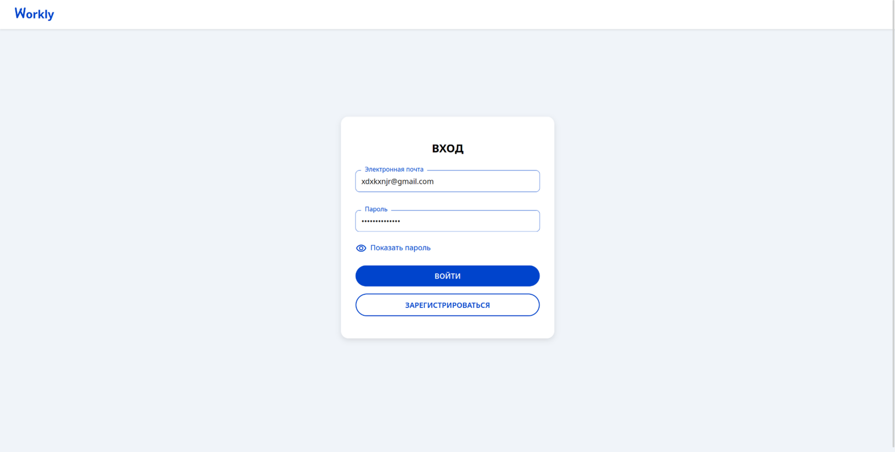
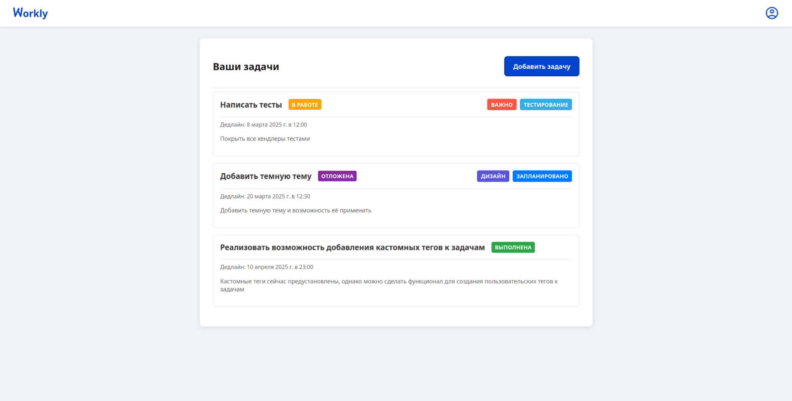
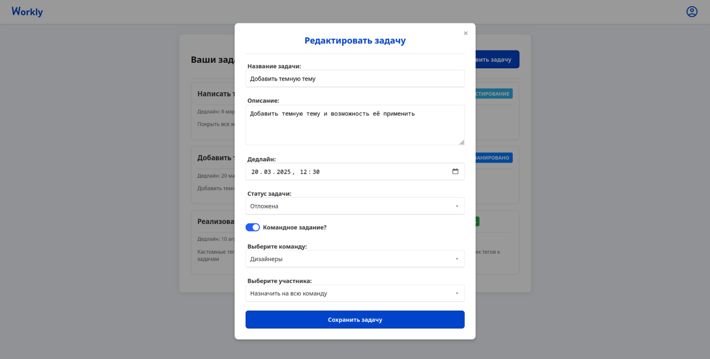
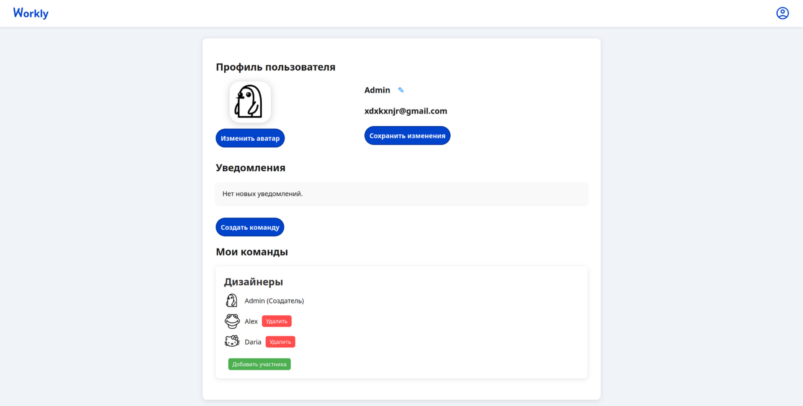

# Workly

**Workly** – это веб-приложение для управления задачами и работы в команде. С помощью него можно эффективно **организовать работу**, **распределять задачи** и **контролировать выполнение**.

---

## **Функциональность**

В **первом релизе** было сделано:

✅ **Регистрация и авторизация пользователей**  
✅ **Редактирование профиля** (смена имени, аватарки)  
✅ **Создание и управление командами** (добавление/удаление участников)  
✅ **Создание индивидуальных и командных задач**  
✅ **Редактирование задач** (изменение дедлайнов, тегов, статусов)  
✅ **Гибкая система доступа к задачам**

> ✨ **Workly** поддерживает как личные задачи, так и командную работу с распределением ролей.

---
## 📸 **Скриншоты**
### 🔑 **Страница входа**

### 🏠 **Главная страница**

### ✏️ **Редактирование задачи**

### 👤 **Профиль пользователя**

---
## ⚙️ **Технологии**

### **🔹 Фронтенд**
- **HTML, CSS, JavaScript**

### **🔹 Бэкенд**
- **Go (Golang)** – высокопроизводительный сервер
- **PostgreSQL** – надежная база данных
- **REST API** – CRUD для задач, пользователей и команд

---
## 🔧 Планы по доработке
### 📌 В следующих версиях:

- 📅 Календарь задач
- 🔔 Система уведомлений
- 🏆 Геймификация (баллы за выполнение задач)
- 📊 Аналитика по задачам
- 📡 Реалтайм-обновления (WebSockets)